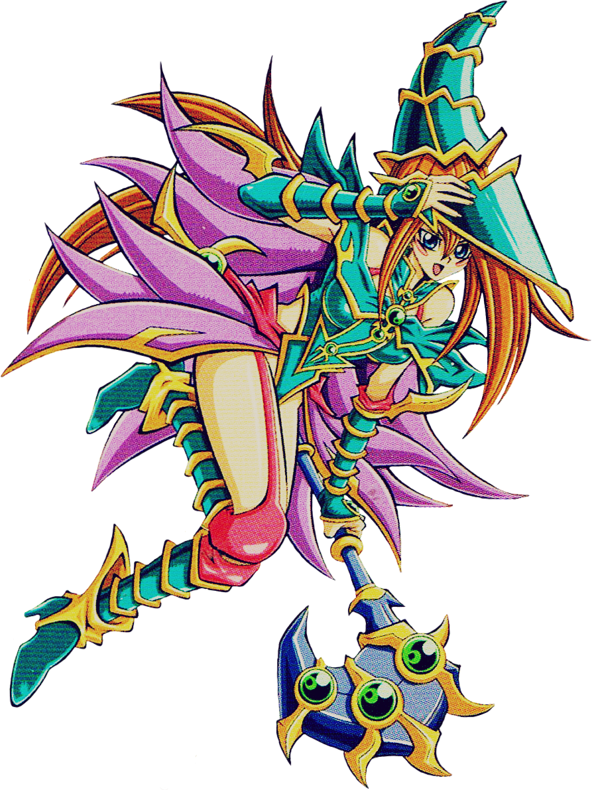

<h1 align="center">Hi 👋, I'm Lucas</h1>
<h3 align="center">A full stack developer with more experience in front end, I'm looking for challenges to continue learning.</h3>

# 

      
  
  
  
  
  
  
  
      
  
  
  

   
    

     
    

 

    

  

    <!--     -->
    <!--        -->
    <a href="https://app.daily.dev/LucasAlvares"> 
  

     

         

